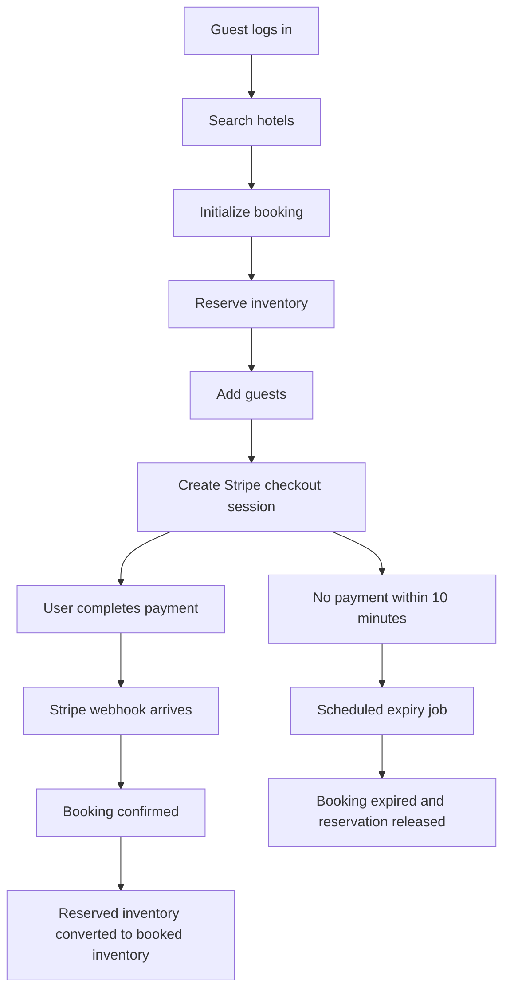

# Airbnb Style Hotel Booking & Inventory Management API

A Spring Boot backend for an Airbnb-inspired hotel booking platform that supports hotel onboarding, room and inventory management, hotel discovery, secure user authentication, dynamic pricing, Stripe checkout, booking confirmation, cancellation, refunds, and scheduled expiry of stale reservations.

This project is built as a role-based REST API where:

- guests can sign up, browse hotels, maintain traveler profiles, and complete bookings
- hotel managers can create hotels, define room types, control inventory, and view booking reports
- the system protects room availability with database locking and scheduled cleanup jobs to reduce overbooking risk

## Highlights

- Java 21 + Spring Boot 4
- PostgreSQL + Spring Data JPA
- JWT-based stateless authentication
- Role-based authorization for `GUEST` and `HOTEL_MANAGER`
- Stripe Checkout integration with webhook-based payment confirmation
- Dynamic room pricing with pluggable pricing strategies
- Scheduled jobs for stale booking expiry and price refresh
- OpenAPI/Swagger UI via Springdoc

## Tech Stack

- Java 21
- Spring Boot
- Spring Web MVC
- Spring Security
- Spring Data JPA
- PostgreSQL
- ModelMapper
- JJWT
- Stripe Java SDK
- Springdoc OpenAPI
- Maven

## What The API Does

This API models the core backend of a hotel marketplace:

1. A user signs up as a guest.
2. By default user is created as guest, so he can promote their role to Hotel Manager so that he can add hotels.
3. A hotel manager creates one or more hotels.
4. Rooms are added to hotels with base price, capacity, amenities, and room count.
5. When a hotel becomes active, inventory is generated for each room for the next year.
6. Guests search hotels by city and date range.
7. A booking is initialized by reserving inventory for the requested room and dates.
8. Guests are attached to the booking.
9. Stripe Checkout is started for payment.
10. Stripe webhook confirmation moves reserved inventory to booked inventory and confirms the booking.
11. If payment is never completed, a scheduled job expires the booking and releases reserved stock.
12. Confirmed bookings can be cancelled and refunded.

## Core Domain

### Roles

- `GUEST`
- `HOTEL_MANAGER`

### Main Entities

- `User`: authenticated account with profile data and one or more roles
- `Hotel`: property managed by a hotel owner
- `Room`: room category inside a hotel with base price, capacity, photos, amenities, and total count
- `Inventory`: per-room, per-day stock record holding booked count, reserved count, closure state, surge factor, and price
- `Booking`: reservation/payment lifecycle record for a user, hotel, room, dates, guest list, and total amount
- `Guest`: reusable traveler profile saved by a user
- `HotelMinPrice`: precomputed per-day minimum hotel price used to speed up browsing

### Booking States

- `RESERVED`
- `GUESTS_ADDED`
- `PAYMENTS_PENDING`
- `CONFIRMED`
- `CANCELLED`
- `EXPIRED`

## Database Schema

The data model is centered around users, hotels, rooms, daily inventory, and bookings. Guests and roles are modeled separately so one user can manage saved travelers and hold multiple roles, while inventory is tracked at the room-per-day level to support safe reservation and booking transitions.

### Schema Overview


### Why This Schema Works Well

- `inventory` is the operational heart of the system because it tracks room availability at the daily level
- `booking` stores the reservation lifecycle and links a user, hotel, room, dates, and payment session together
- `booking_guest` allows one booking to include multiple guests while also letting guests be reused in future bookings
- `hotel_min_price` acts like a browse-time optimization table for faster hotel search
- `user_roles` supports role-based access without hardcoding a single role per user
- `payment` gives a clean extension point for capturing transaction-level payment records alongside Stripe checkout

## Architecture

The project follows a layered Spring Boot structure:

- `controller`: REST endpoints
- `service`: business logic
- `repository`: JPA repositories and custom queries
- `entity`: persistence model
- `dto`: request/response payloads
- `security`: JWT auth filter, token service, and auth flow
- `strategy`: dynamic pricing strategies
- `advice`: centralized exception and response handling
- `jobs`: scheduled operational jobs
- `config`: Stripe and ModelMapper configuration

### Package Layout

```text
src/main/java/com/projects/airbnb
|-- advice
|-- config
|-- controller
|-- dto
|-- entity
|-- exception
|-- jobs
|-- repository
|-- security
|-- service
|-- strategy
`-- util
```

## How Inventory And Booking Safety Work

The booking flow is designed to protect availability:

- inventory is stored per room per day
- during booking initialization, the API uses pessimistic locking on matching inventory rows
- reserved stock is incremented first, before payment succeeds
- after Stripe confirms payment, reserved stock is converted into booked stock
- if a booking stays incomplete for more than 10 minutes, a scheduled job marks it `EXPIRED` and releases reserved stock

This makes the flow safer than a simple read-then-write model and helps avoid race-condition-based double booking.

## Dynamic Pricing

Pricing is recalculated through the pricing service and strategy package. The codebase includes these pricing strategies:

- base pricing
- occupancy pricing
- surge pricing
- urgency pricing
- holiday pricing

The system also maintains `HotelMinPrice`, which stores the cheapest available price snapshot for each hotel per date so hotel browsing can be faster than scanning all room inventories every time.

## Booking Flow



## API Base URL

The application runs with this context path:

```text
/api/v1
```

Example local base URL:

```text
http://localhost:8080/api/v1
```

## Authentication

The API uses JWT bearer authentication.

- `POST /auth/login` returns an access token and refresh token
- the refresh token is also stored in an HTTP-only cookie named `refreshToken`
- authenticated endpoints expect `Authorization: Bearer <access_token>`
- admin endpoints require the `HOTEL_MANAGER` role

### Security Rules

- `/admin/**` requires `ROLE_HOTEL_MANAGER`
- `/booking/**` requires authentication
- `/users/**` requires authentication
- browse, auth, health, and webhook endpoints are public

## API Modules

### 1. Auth

#### `POST /auth/signup`

Creates a user account.

Sample request:

```json
{
  "name": "Akash",
  "email": "akash@example.com",
  "password": "StrongPass123"
}
```

#### `POST /auth/login`

Authenticates a user and returns access and refresh tokens.

Sample request:

```json
{
  "email": "akash@example.com",
  "password": "StrongPass123"
}
```

#### `POST /auth/refresh`

Generates a new access token using the refresh token cookie.

### 2. User Profile And Guest Profiles

#### `GET /users/profile`

Returns the currently logged-in user profile.

#### `PATCH /users/profile`

Updates selected profile fields.

Sample request:

```json
{
  "name": "Akash Sharma",
  "dateOfBirth": "1998-03-12",
  "gender": "MALE"
}
```

#### `PATCH /users/promote-to-hotel-manager`

Adds the `HOTEL_MANAGER` role to the current user.

#### `GET /users/myBookings`

Returns bookings belonging to the current user.

#### `GET /users/guests`

Returns saved guest profiles for the current user.

#### `POST /users/guests`

Adds a reusable guest profile.

#### `PUT /users/guests/{guestId}`

Updates an existing guest profile.

#### `DELETE /users/guests/{guestId}`

Deletes a guest profile.

Sample guest payload:

```json
{
  "name": "Riya",
  "gender": "FEMALE",
  "age": 27
}
```

### 3. Hotel Browse

#### `GET /hotels/search`

Searches hotels by city, date range, room count, page, and size.

Current implementation note:
This endpoint is defined as a `GET` that accepts a request body, so clients need to send the search payload in the body rather than as query parameters.

Sample request:

```json
{
  "city": "Goa",
  "startDate": "2026-05-10",
  "endDate": "2026-05-12",
  "roomsCount": 1,
  "page": 0,
  "size": 10
}
```

#### `GET /hotels/{hotelId}/info`

Returns hotel details plus room information.

### 4. Booking Flow

#### `POST /booking/init`

Creates a booking in `RESERVED` state after inventory is locked and reserved.

Sample request:

```json
{
  "hotelId": 1,
  "roomId": 2,
  "checkInDate": "2026-05-10",
  "checkOutDate": "2026-05-12",
  "roomsCount": 1
}
```

#### `POST /booking/{bookingId}/addGuests`

Attaches one or more guests and moves the booking to `GUESTS_ADDED`.

#### `POST /booking/{bookingId}/payments`

Creates a Stripe Checkout session and returns a `checkoutUrl`.

#### `GET /booking/{bookingId}/status`

Returns the current booking status.

#### `POST /booking/{bookingId}/cancel`

Cancels a confirmed booking, releases booked inventory, and triggers a Stripe refund.

### 5. Admin Hotel Management

These endpoints require a hotel-manager token.

#### `POST /admin/hotels`

Creates a hotel. Hotels are created as inactive by default.

Sample request:

```json
{
  "name": "Sea Breeze Resort",
  "city": "Goa",
  "photos": ["https://example.com/h1.jpg"],
  "amenities": ["Pool", "WiFi", "Breakfast"],
  "hotelContactInfo": {
    "address": "Calangute Beach Road",
    "phoneNumber": "+91-9999999999",
    "location": "15.5439,73.7553",
    "email": "hello@seabreeze.com"
  }
}
```

#### `GET /admin/hotels`

Returns hotels owned by the current manager.

#### `GET /admin/hotels/{hotelId}`

Returns one owned hotel.

#### `PUT /admin/hotels/{hotelId}`

Updates a hotel.

#### `PATCH /admin/hotels/{hotelId}`

Activates the hotel. Activation initializes room inventory for the next year.

#### `DELETE /admin/hotels/{hotelId}`

Deletes the hotel and related room inventories.

#### `GET /admin/hotels/{hotelId}/bookings`

Returns bookings for the selected hotel.

#### `GET /admin/hotels/{hotelId}/reports`

Returns a hotel booking report. If dates are omitted, the API defaults to the last month.

### 6. Admin Room Management

#### `POST /admin/hotels/{hotelId}/rooms`

Creates a room inside a hotel.

Sample request:

```json
{
  "type": "Deluxe",
  "basePrice": 4500,
  "amenities": ["AC", "WiFi", "Ocean View"],
  "photos": ["https://example.com/room1.jpg"],
  "totalCount": 8,
  "capacity": 2
}
```

#### `GET /admin/hotels/{hotelId}/rooms`

Lists rooms in a hotel.

#### `GET /admin/hotels/{hotelId}/rooms/{roomId}`

Returns one room.

#### `PUT /admin/hotels/{hotelId}/rooms/{roomId}`

Updates room metadata. If base price or total count changes, future inventory is recalculated.

#### `DELETE /admin/hotels/{hotelId}/rooms/{roomId}`

Deletes the room and its inventory.

### 7. Admin Inventory Management

#### `GET /admin/inventory/rooms/{roomId}`

Returns all inventory rows for a room ordered by date.

#### `PATCH /admin/inventory/rooms/{roomId}`

Bulk-updates inventory across a date range.

Sample request:

```json
{
  "startDate": "2026-12-20",
  "endDate": "2026-12-31",
  "surgeFactor": 1.5,
  "closed": false
}
```

### 8. Payments And Webhooks

#### `POST /webhook/payment`

Receives Stripe webhook events and confirms successful checkout sessions.

### 9. Health Check

#### `GET /health`

Simple API heartbeat endpoint.

## Request Validation

The API uses Jakarta Validation annotations on DTOs to validate:

- required fields
- email format
- password length
- positive price and room count constraints
- guest age constraints
- profile date-of-birth rules

## Error Handling

Centralized exception handling is implemented for:

- validation errors
- authentication failures
- JWT failures
- authorization failures
- resource-not-found cases
- unexpected server errors

Error responses are generated through the global exception handler.

## Configuration

The project uses Spring profiles.

- `application.yml` sets the default active profile to `dev`
- `application-dev-template.yml` is the local template you should copy and rename to `application-dev.yml`
- `application-prod.yml` reads its configuration from environment variables

### Local Configuration Template

Create `src/main/resources/application-dev.yml` from the template and fill in your values:

```yaml
spring:
  datasource:
    url: jdbc:postgresql://localhost:5432/airbnb
    username: your_db_username
    password: your_db_password
  jpa:
    show-sql: true
    hibernate:
      ddl-auto: update

jwt:
  secret:
    key: your_jwt_secret

stripe:
  secret:
    key: your_stripe_test_key
  webhook:
    secret: your_stripe_webhook_secret

base:
  url: http://localhost:8080/api/v1
```

### Production Environment Variables

- `DB_URL`
- `DB_USERNAME`
- `DB_PASSWORD`
- `JWT_SECRET_KEY`
- `STRIPE_SECRET_KEY`
- `STRIPE_WEBHOOK_SECRET`
- `BASE_URL`

## Local Setup

### Prerequisites

- Java 21
- Maven 3.9+
- PostgreSQL
- Stripe test account

### Steps

1. Clone the repository.
2. Create a PostgreSQL database named `airbnb`.
3. Create `src/main/resources/application-dev.yml` from `application-dev-template.yml`.
4. Fill in database, JWT, and Stripe credentials.
5. Start PostgreSQL.
6. Run the application.

```bash
./mvnw spring-boot:run
```

On Windows:

```powershell
.\mvnw.cmd spring-boot:run
```

## API Documentation

Springdoc is included in the project, so after startup you can access:

- Swagger UI: `http://localhost:8080/api/v1/swagger-ui/index.html`
- OpenAPI spec: `http://localhost:8080/api/v1/v3/api-docs`

## Scheduled Jobs

### Booking expiry job

- runs every 60 seconds
- expires bookings older than 10 minutes in `RESERVED`, `GUESTS_ADDED`, or `PAYMENTS_PENDING`
- releases reserved inventory

### Pricing update job

- runs hourly
- recalculates dynamic inventory pricing
- refreshes the `HotelMinPrice` browse cache

## Deployment Notes

The repository includes `buildspec.yml` for AWS CodeBuild style packaging. The build currently:

- uses Corretto 21
- runs `mvn package -DskipTests`
- publishes the generated JAR from `target/`

## Suggested End-To-End Usage Flow

1. Sign up and log in.
2. Promote your account to hotel manager.
3. Create a hotel.
4. Add rooms to the hotel.
5. Activate the hotel.
6. Search for hotels as a guest.
7. Initialize a booking.
8. Add guests.
9. Complete payment with Stripe Checkout.
10. Verify the booking becomes `CONFIRMED`.

